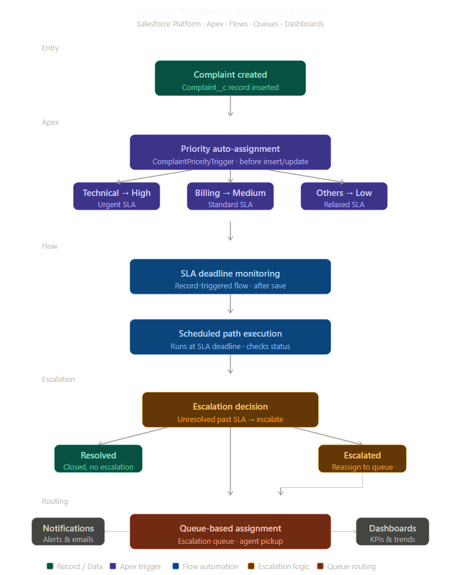
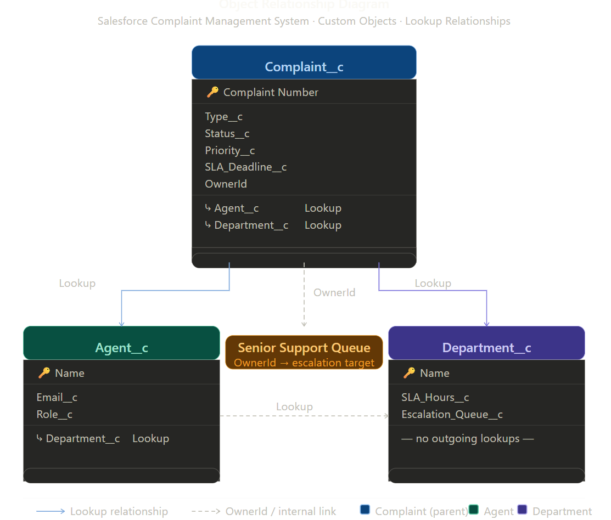

# Salesforce Complaint Management System

A Salesforce-based automation platform for managing complaint lifecycle tracking, SLA monitoring, escalation workflows, and queue-based routing using Record-Triggered Flows and Apex Triggers.

---

## Project Overview

This system automates complaint handling from creation to resolution by enforcing SLA deadlines, escalating unresolved complaints, notifying support agents, and providing real-time reporting dashboards.

It demonstrates practical application of Salesforce declarative and programmatic automation for CRM workflow design.

---

## Key Features

- Custom objects: `Complaint__c`, `Agent__c`, `Department__c` with lookup relationships
- Apex Trigger to auto-assign complaint priority based on complaint type
- Record-Triggered Flow for dynamic SLA deadline calculation
- Scheduled-path escalation for unresolved complaints
- Queue-based routing for escalated complaints
- Automated email notifications on status change
- Reports and dashboards for complaint analytics and SLA monitoring

---

## System Architecture

Complaint Created
↓
Priority Assignment (Apex Trigger)
↓
SLA Deadline Calculation (Record-Triggered Flow)
↓
Scheduled Path Execution
↓
Escalation Decision Logic
↓
Queue-Based Assignment
↓
Agent Notifications
↓
Dashboard Reporting



---

## Data Model

**Custom Objects:** `Complaint__c`, `Agent__c`, `Department__c`

**Relationships:**
- `Complaint__c` → `Agent__c` (Lookup)
- `Complaint__c` → `Department__c` (Lookup)
- `Department__c` → Escalation Queue Mapping



---

## Automation Components

### Apex Trigger

Automatically assigns complaint priority based on complaint type.

```apex
trigger ComplaintPriorityTrigger on Complaint__c (before insert, before update) {
    for (Complaint__c comp : Trigger.new) {
        if (comp.Type__c == 'Technical') {
            comp.Priority__c = 'High';
        } else if (comp.Type__c == 'Billing') {
            comp.Priority__c = 'Medium';
        } else {
            comp.Priority__c = 'Low';
        }
    }
}
```

### Record-Triggered Flow
Calculates SLA deadline dynamically based on department SLA hours.

### Scheduled Path Flow
Checks whether complaints remain unresolved after the SLA deadline and escalates automatically.

### Queue-Based Routing
Assigns escalated complaints to the Senior Support Queue.

### Notification Flow
Sends automated alerts when complaint status changes.

---

## Reports & Dashboards

Dashboard includes:
- Complaints by Status
- Complaints by Priority
- SLA Performance Tracking
- Escalation Trends

---

## Technologies Used

- Salesforce (Platform Cloud)
- Apex Triggers
- Record-Triggered Flows
- Scheduled Paths
- Queue-Based Routing
- Email Notifications
- Reports & Dashboards

---

## Business Value

This system improves support efficiency by:
- Enforcing SLA compliance across departments
- Automating escalation workflows to reduce manual intervention
- Eliminating manual routing effort through queue-based assignment
- Improving complaint visibility through real-time dashboards
- Enabling faster resolution tracking for support teams
